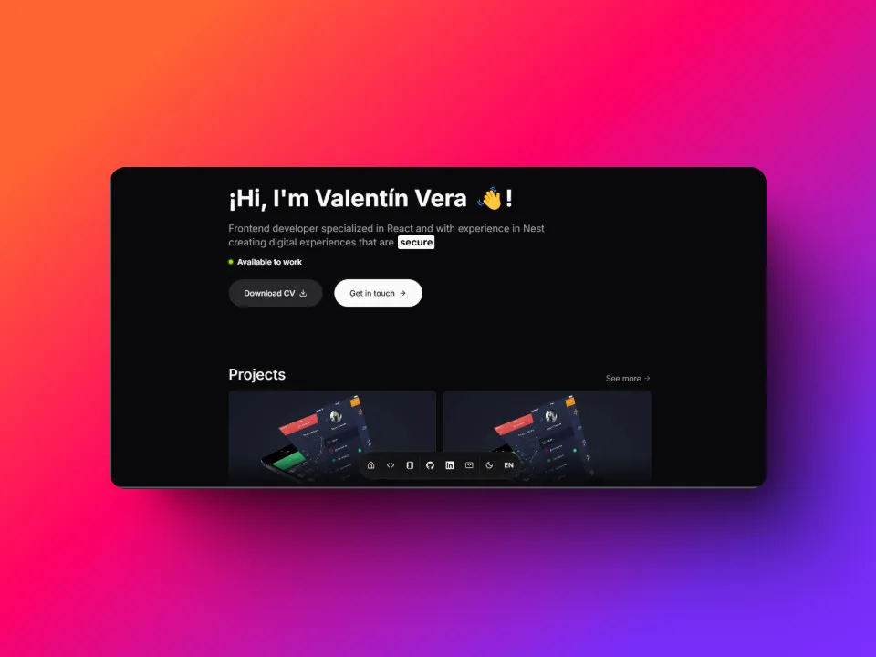

  
  

  <a href="https://valentinvera.vercel.app" target="_blank">
    Website
  </a>
  &nbsp;|&nbsp;
  <a href="https://github.com/valentinvera/portfolio#stack">
    Stack
  </a>
  &nbsp;|&nbsp;
  <a href="https://github.com/valentinvera">
    GitHub
  </a>
  &nbsp;|&nbsp;
  <a href="https://www.linkedin.com/in/valentinvera">
    LinkedIn
  </a>
  &nbsp;|&nbsp;
  <a href="https://x.com/vvalentinvera">
    X
  </a>

# Valentin Vera Portfolio

Personal portfolio for Valentín Vera, Full Stack Developer and product creator building products that help people and solve real problems.

## Stack

- [**React 19**](https://react.dev/) - UI library for building interactive interfaces.
- [**TypeScript**](https://www.typescriptlang.org/) - JavaScript with type safety.
- [**Vite**](https://vite.dev/) - Fast development server and production bundler.
- [**Tailwind CSS**](https://tailwindcss.com/) - Utility-first CSS framework.
- [**TanStack Router**](https://tanstack.com/router) - Type-safe routing for React applications.
- [**Motion**](https://motion.dev/) - Animation library for React interfaces.
- [**Radix UI**](https://www.radix-ui.com/) - Accessible primitives for UI components.
- [**React Hook Form**](https://react-hook-form.com/) + [**Zod**](https://zod.dev/) - Form state management and schema validation.
- [**i18next**](https://www.i18next.com/) + [**react-i18next**](https://react.i18next.com/) - Internationalization for Spanish and English content.
- [**Lucide React**](https://lucide.dev/) - Icon set used across the interface.
- [**Biome**](https://biomejs.dev/) - Formatter and linter.
- [**Bun**](https://bun.sh/) - Package manager and script runner.
- [**Vercel**](https://vercel.com/) - Deployment platform.
